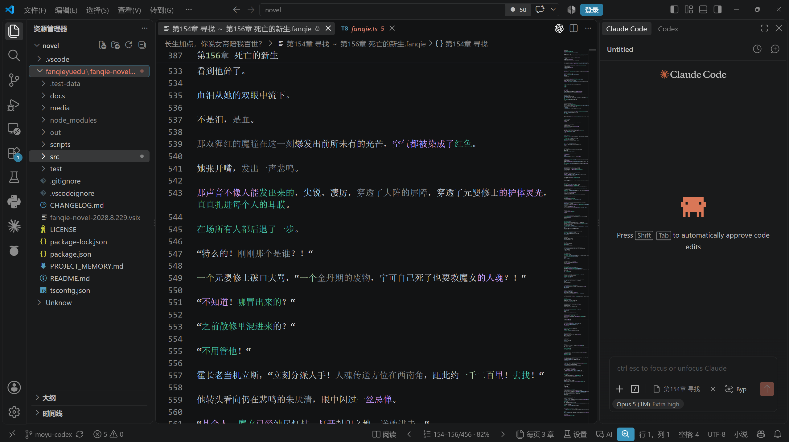
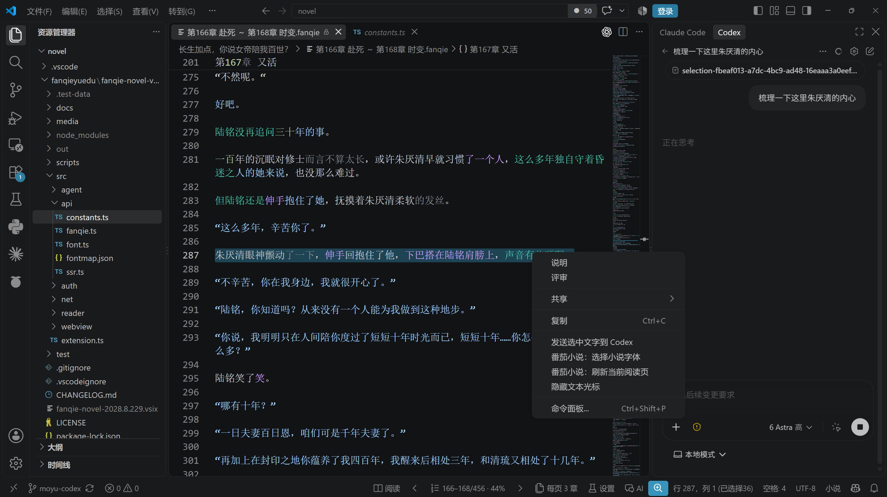

# 码间摸鱼 · Moyu Code Reader

**把小说放进代码编辑器，把问题连同上下文交给 Codex。**

一个主打 **摸鱼阅读 · 代码伪装 · Codex 上下文交互** 的 VS Code 番茄小说阅读器。
不再在编辑器里套一张网页阅读页，而是把正文变成真正的只读文本文件：主题、行号、缩略图、选区、查找都用 VS Code 原生能力。

[下载安装](https://github.com/Xinyue-QwQc/moyu-code-reader/releases/latest) · [完整使用指南](docs/reading-guide.md) · [改动记录](CHANGELOG.md) · [上游项目](https://github.com/zwb8926/fanqie-novel-vscode)

> 本项目是 [zwb8926/fanqie-novel-vscode](https://github.com/zwb8926/fanqie-novel-vscode) 的独立增强分支，保留 Fork 关系与 MIT 许可。开发和文档编写由 **OpenAI Codex 辅助**，不是 OpenAI 或番茄小说官方产品。

## 三件事，做到顺手

### 1. 摸鱼阅读：少一点阅读器的存在感

- 正文就是 **VS Code 原生编辑器**，没有悬浮阅读工具栏；翻章、目录、设置收在底部状态栏。
- 一页合并 **1–50 章**，默认自动折行、原段落之间空一行；关闭后重开可续读，调整每页章节数也保留章内位置。
- 字体不用记名字：**点击选择已安装字体**，自动区分中文／非中文，中文列表按实际字形覆盖筛选。
- 正文右键 **隐藏文本光标**，同时关闭光标所在行的背景、边框和行号区高亮；点击、方向键移动、切章后仍保持。**鼠标指针和选中文字的高亮保留。**
- 窄侧边栏也能正常用：导航不挤成竖排，搜索按钮不溢出；切换侧边栏保留页面、搜索草稿和滚动状态。

### 2. 代码伪装：读的是小说，配的是代码色

不是给小说加几个假括号，也不是只给引号上色。它把叙述、对白、数字和词组映射成代码主题中的不同语法色，**正文与原生缩略图同步多色**。

| 模式 | 效果 | 适合 |
| --- | --- | --- |
| 关闭（默认） | 正常正文，柔和对白高亮 | 舒适阅读 |
| 平衡 | 叙述按词组分色，保留整段对白 | 低调一点，也好读一点 |
| 强伪装 | 分色更密，连对白也参与词组分色 | 更接近代码页的彩色块分布 |

入口：阅读页 **设置 → 实验性代码伪装配色**。只改颜色，**不改小说原文**；复制、查找和 AI 读取仍得到原文，关闭后恢复之前的阅读配色。



*维护者提供的实际阅读截图：代码伪装配色、自动折行、段间空行与原生彩色缩略图。*

> “摸鱼”是产品定位，不是隐身承诺。书名、章节名和文字仍可辨认；代码外观不等于防截屏、防审计，也不保证不会被认出是在读小说。

### 3. Codex 上下文：不用反复复制整章，也不必先打开所有章节

**只聊一段：** 选中正文 → 右键 **发送选中文字到 Codex**。自动生成选区的本地快照，加入 Codex 会话附件；之后改变选区，不会改掉已添加的内容。

**聊当前章节或整本书：** 点击状态栏 **AI → 提供当前上下文给 Codex**。附件包含当前书籍、章节、可见正文和读取入口；Codex 可按你的问题读取未展示章节，或查找另一本书，**不打断当前阅读位置**。

例如，在加入上下文后可以问：

- “这段对话中，两个人各自在隐瞒什么？请引用原文解释。”
- “比较前后两章对同一人物的描写，只分析我读到的位置，不要剧透。”
- “查一下目录，找到这个事件相关的章节，再按需读取。”

右键入口会**提前检测 Codex 扩展及其附件能力**；没安装就不显示。点击只添加上下文，**不自动提交聊天、不自动调用模型**。无需改 Codex 配置，也不用另搭 MCP 服务；模型何时读取材料、如何回答仍由 Codex 自身决定。



*截图展示隔离测试环境中的入口与附件命令；不代表无需登录 Codex 或无需模型服务。*

支持本地文件／终端的其他 AI 工具，也可使用状态栏的 **打开上下文文件**；对接 VS Code Language Model Tools API 的客户端还可调用插件提供的原生阅读工具。详见[AI 阅读访问](docs/reading-guide.md#让-codex--其他-agent-读取小说)。

## 相比上游，我们主要改了什么？

上游提供了番茄小说的书城、搜索、扫码登录、书架、历史记录与书评能力。本分支保留这些基础，重点重做 **阅读体验、伪装外观和 AI 上下文交接**。

| 方向 | 本分支的主要改动 |
| --- | --- |
| 阅读载体 | 从 Webview 正文改为原生只读文本编辑器；保留原生查找、复制、分屏、滚动与缩略图 |
| 代码伪装 | 新增可选的平衡／强伪装语义分色，正文和缩略图同步，原文不变 |
| Codex 交互 | 新增选区附件、当前阅读上下文、本地只读访问入口，支持按需读取未展示章节 |
| 长篇续读 | 一页合并多章、原生目录、章内光标与视口恢复、重排后保留位置 |
| 阅读排版 | 默认折行和段间空行；新增语言筛选字体选择器、独立行高／段距／配色 |
| 右键操作 | 选择字体、刷新当前阅读页、隐藏／显示文本光标，以及条件显示的 Codex 入口 |
| 侧边栏稳定性 | 窄栏响应式布局；保留视图状态、去掉重复请求，阅读进度只更新对应条目，不再反复重画整页 |
| 可验证性 | 增加单元测试、真实 VS Code 集成测试、重启续读验证，以及不调用模型的 Codex 附件测试 |

更多界面：[窄侧边栏](docs/images/narrow-sidebar.png) · [字体选择器](docs/images/font-picker.png)

## 安装与开始摸鱼

1. 从[本仓库 Releases](https://github.com/Xinyue-QwQc/moyu-code-reader/releases/latest)下载 `.vsix`。
2. VS Code 扩展视图右上角 **… → 从 VSIX 安装**，选择下载的文件，按提示重载窗口。
3. 打开活动栏 **番茄小说**，从书城、搜索、书架或历史记录选一本书。
4. 想要代码外观，开启 **设置 → 实验性代码伪装配色**；想聊剧情，选中正文后发送给 Codex。

**兼容说明：** 本分支暂时保留原扩展标识 `zwb8926.fanqie-novel`，以便延续已安装版本的书架、设置和进度；安装本仓库 VSIX 会替换同标识版本，**不会与上游版并存**。这里的发布是个人 Fork 的 GitHub Release，不是原作者的 Marketplace 更新。

需要 Codex 功能时，请另行安装并配置 [Codex IDE 扩展](https://developers.openai.com/codex/ide)。不装 Codex 也能正常阅读、使用代码伪装。

## 分支与上游

| 分支 | 用途 |
| --- | --- |
| [`moyu-codex`](https://github.com/Xinyue-QwQc/moyu-code-reader/tree/moyu-codex) | 本仓库默认分支：摸鱼阅读、代码伪装与 Codex 增强 |
| [`main`](https://github.com/Xinyue-QwQc/moyu-code-reader/tree/main) | 创建 Fork 时保留的上游主分支基线，供对照与后续同步，不承诺自动同步 |

本地开发建议保留 `upstream` 指向原仓库、`origin` 指向自己的 Fork。**不向原仓库直接推送这些改动。**

## AI 辅助开发说明

本分支由 **[Xinyue-QwQc](https://github.com/Xinyue-QwQc)** 发起维护，使用 **OpenAI Codex** 辅助需求整理、代码实现、问题排查、测试和 README 编写。仓库中的 `Codex <codex@local.invalid>` 是本地 AI 辅助提交标识，不表示 OpenAI 官方维护或审核。

AI 辅助不是质量保证：功能说明以实际实现和可复现测试为依据；维护者仍负责功能取舍、复核与后续维护。感谢上游作者与依赖项目，本分支不把上游成果归为 AI 或自身原创。

## 本地构建与验证

```sh
git clone --branch moyu-codex https://github.com/Xinyue-QwQc/moyu-code-reader.git
cd moyu-code-reader
npm ci
npm test
npm run test:integration
npm run package
```

- `npm test`：文本保留、语义配色、字体筛选、权限边界和状态写入等单元测试。
- `npm run test:integration`：独立用户数据目录下的真实 VS Code，使用原创离线样章；验证界面、右键操作、200–480 px 窄栏、光标／当前行隐藏、切章与重启续读。
- 可选 Codex 测试：设置 `FANQIE_CODEX_EXTENSION` 为已安装 Codex 的目录后运行集成测试；**只验证附件交接，不发送模型请求**。
- 字体枚举针对 Windows、macOS、Linux 分别实现；当前发布主要在 **Windows + VS Code** 验证，其他系统仍欢迎反馈。Linux 字体列表依赖 `fontconfig` 的 `fc-list`。

## 隐私与使用边界

- 不主动把正文上传给模型；是否发送对话和使用哪种模型由你决定。
- 登录 Cookie 留在认证层，不进入 AI 附件。实时读取入口仅监听本机回环地址，并使用会话令牌；关闭 AI 阅读访问可停用它。
- 阅读材料来自番茄平台；仅返回官方允许读取的内容，不绕过付费、登录或其他访问权限。
- 遵守内容平台条款与所在环境的使用规则；不提供批量抓取承诺。

## 致谢与许可

- 上游：[zwb8926/fanqie-novel-vscode](https://github.com/zwb8926/fanqie-novel-vscode)，原始版权声明保留。
- 字体字符表参考：[ying-ck/fanqienovel-downloader](https://github.com/ying-ck/fanqienovel-downloader)、[fysh1010/mcp-server-fanqie](https://github.com/fysh1010/mcp-server-fanqie)。
- 接口研究参考：[naiyQAQ/fanqie-assistant](https://github.com/naiyQAQ/fanqie-assistant)。

[MIT License](LICENSE)。小说内容不因本项目的代码许可而改变其原有版权归属。
